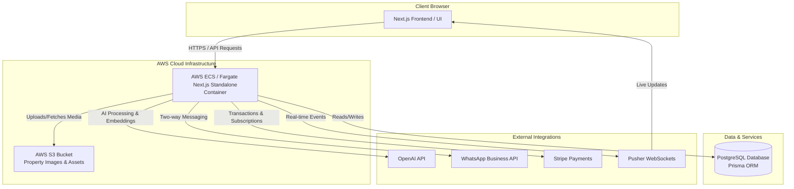

# AURA LEAD CRM

- **Overview**: A specialized CRM platform tailored for real estate businesses and modern brokerage agencies.
- **Core Features**: Comprehensive client management, interactive pipeline tracking, real-time WhatsApp messaging integration (sending and receiving), property portfolio administration, and agent/broker hierarchy management.
- **Live Demo**: Explore the live application at [crm.adrianfdz.com](https://crm.adrianfdz.com).

---

## Architecture & Tech Stack

- **Frontend & Backend**: Built with Next.js (App Router), TypeScript, and Tailwind CSS for a fully responsive and optimized user experience.
- **Database & ORM**: PostgreSQL managed via Prisma ORM, utilizing advanced relational schemas and vector storage capabilities.
- **Cloud Infrastructure & DevOps**: Containerized using Docker, hosted on AWS (ECS & Fargate), and automated through a seamless GitHub Actions CI/CD pipeline.
- **Integrations**: Powered by OpenAI APIs for intelligent processing and WhatsApp Business APIs for direct client communication. 

## Main Features

- **Multi-Tenant Architecture**: Isolate data securely across multiple real-estate agencies or business branches within a single unified platform.
- **Property Portfolio Management**: Complete CRUD operations for real estate listings, including detailed specifications, pricing, and status tracking.
- **AI-Powered Insights**: Integrated OpenAI APIs to enhance lead processing, semantic search, and automated recommendations.
- **WhatsApp Business Integration**: Direct two-way messaging capabilities to receive client inquiries and send updates straight from the CRM interface.
- **Secure Payment Processing**: Integrated Stripe payment gateways for handling subscriptions, transactions, or service fees seamlessly.
- **Real-Time Communication**: Powered by Pusher web sockets for instant notifications, live chat updates, and active pipeline triggers.
- **Cloud Storage Infrastructure**: Scalable media management leveraging AWS S3 buckets for storing property images, documents, and secure assets. 

## System Architecture



## Getting Started & Deployment

### Prerequisites

Make sure you have the following tools installed on your local machine:
- **Node.js** (v20 or higher recommended)
- **npm** or **pnpm** package manager
- **Docker** and Docker Compose (for running containerized services locally)
- **Git** for version control

### Environment Variables

To run this project locally, you need to create a `.env` file in the root directory based on the provided `.env.example`. The core variables required include:

- **Database**: `DATABASE_URL` (PostgreSQL connection string)
- **Security & Auth**: `JWT_SECRET`, `ENCRYPTION_KEY`
- **Integrations**: `STRIPE_SECRET_KEY`, `OPENAI_API_KEY`, `WHATSAPP_VERIFY_TOKEN`
- **Real-Time & Storage**: `PUSHER_*` configurations and AWS S3 credentials (`AWS_ACCESS_KEY_ID`, `AWS_BUCKET_NAME`, etc.)

*(See `.env.example` for the complete list of required configuration keys).*

### Local Development Setup

Follow these steps to get the project running on your local machine:

1. **Clone the repository:**
```bash
git clone https://github.com/your-username/aura-lead-crm.git
cd aura-lead-crm
```

2. **Install dependencies:** 
```bash
npm install
```

3. **Configure environment variables:**
Copy the example environment file and fill in your local credentials:
```bash
cp .env.example .env 
``` 

3. **Set up the database:**
Run Prisma migrations and seed the database with initial data:
```bash 
npx prisma migrate dev
npx prisma db seed
```
4. **Start the development server:**
```bash
npm run dev
```
Open http://localhost:3000 in your browser to see the application running. 

### Deployment & CI/CD

The application features a fully automated CI/CD pipeline using **GitHub Actions** and **AWS**:

1. **Continuous Integration**: Every push to the main branch triggers automated code checks, linting, and build verification.
2. **Containerization**: The application is packaged into a secure, production-ready container image using the optimized `Dockerfile`.
3. **Cloud Delivery**: Built images are pushed and deployed directly to **AWS ECS (Fargate)**, ensuring seamless zero-downtime updates and scalable cloud infrastructure.


